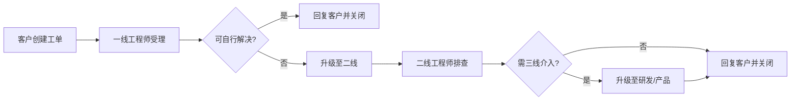

# 云联科技 —— 工单服务规范（内部制度）

> 版本：v2.2.0 | 生效日期：2026-03-01

---

## 1. 目的与适用范围

### 1.1 目的

为规范云联科技内部工单处理流程，保障客户服务质量，明确各级别工单的响应时效和操作规范，特制定本制度。

### 1.2 适用范围

本制度适用于云联科技技术支持部全体工程师，以及涉及客户问题处理的一线运维、二线研发、三线产品等相关人员。

---

## 2. 工单分级标准

工单按紧急程度和影响范围划分为 P1 ~ P4 四个优先级。

### 2.1 P1 —— 严重故障（Critical）

| 项目 | 说明 |
|------|------|
| 定义 | 核心服务全部不可用，影响所有客户业务 |
| 示例 | ECS 大规模宕机、COS 整体不可用、CDN 全网故障 |
| 响应时效 | ≤ 15 分钟（7×24） |
| 更新频率 | ≤ 1 小时/次 |
| 闭环时效 | 目标 ≤ 4 小时 | 

### 2.2 P2 —— 高优先级（High）

| 项目 | 说明 |
|------|------|
| 定义 | 核心服务部分不可用或有严重性能问题，影响特定客户或地域 |
| 示例 | 单地域 ECS 创建失败、WAF 误拦、CDN 回源异常 |
| 响应时效 | ≤ 30 分钟（工作时间）/ ≤ 2 小时（非工作时间） |
| 更新频率 | ≤ 4 小时/次 |
| 闭环时效 | 目标 ≤ 24 小时 |

### 2.3 P3 —— 普通问题（Medium）

| 项目 | 说明 |
|------|------|
| 定义 | 非关键功能异常或普通咨询问题 |
| 示例 | 控制台页面显示异常、API 文档错误、产品功能咨询 |
| 响应时效 | ≤ 4 小时 |
| 更新频率 | ≤ 24 小时/次 |
| 闭环时效 | 目标 ≤ 72 小时 |

### 2.4 P4 —— 低优先级（Low）

| 项目 | 说明 |
|------|------|
| 定义 | 功能需求建议、文档改进、一般性咨询 |
| 示例 | 产品新功能建议、计费账单咨询、SDK 使用指导 |
| 响应时效 | ≤ 24 小时 |
| 更新频率 | 每 72 小时至少更新一次 |
| 闭环时效 | 目标 ≤ 10 个工作日 |

---

## 3. 工单处理流程

### 3.1 工单创建

客户可通过以下渠道创建工单：
- 云联云控制台 → 工单系统
- API 接口（适用于集成商/大客户）
- 电话客服代创建（仅 P1/P2）

**必填信息：**
- 产品类型（ECS / COS / CDN / 安全 / 其他）
- 所属地域
- 问题描述（至少 20 字）
- 影响范围（涉及的资源 ID 或域名）
- 截图/日志（非必填，但强烈建议）

### 3.2 工单流转

#### 流转规范

1. **一线工程师（T1）**：
   - 负责首次响应、基础排查（常见问题库、重启、配置检查）。
   - 15 分钟内无法解决则升级至二线。
   - 升级时需填写排查摘要和已尝试的操作。

2. **二线工程师（T2）**：
   - 负责深入技术排查（日志分析、网络抓包、代码审查）。
   - 2 小时内无法解决或确认为产品缺陷则升级至三线。
   - 升级时需携带完整的排查报告。

3. **三线工程师（T3 / 研发 / 产品）**：
   - 负责产品缺陷修复、功能缺失评估。
   - 涉及代码修复的，需给出修复时间表。
   - 非紧急缺陷纳入产品路线图，需在工单中明确说明计划版本号。

### 3.3 跨团队协作

- **涉及多产品的工单**：由第一个接入的工程师担任"主责人（Case Owner）"，负责协调各团队并汇总进展。
- **主责人变更**：需在工单中备注变更原因和人员，并通知客户。
- **信息同步**：所有沟通（含内部讨论结论）必须在工单中留痕。

---

## 4. 工程师操作规范

### 4.1 响应规范

- **首条回复**：称呼客户（如"尊敬的云联用户"），简述已知悉的问题，告知预计排查方向。
- **禁止用语**："我不知道"、"这个问题不归我管"、"你自己看文档"。
- **替代用语**：
  - 不确定时："我帮您核实一下，稍后给您回复。"
  - 非本团队问题时："我已将工单转交对应的 xx 团队处理，预计 xx 时间内联系您。"
  - 客户不满时："非常理解您的心情，我们会优先处理您的问题。"

### 4.2 排查规范

- **操作记录**：在 ECS 等产品上执行的所有操作必须在工单中记录，包括命令输出和判断依据。
- **数据安全**：
  - 不要求客户提供明文密码。
  - 日志/截图隐私信息需打码（如 IP、密钥、个人身份信息）。
  - 排查过程中获取的客户数据禁止外传。
- **暂离处理**：预计离线超过 30 分钟需在工单中告知客户并设置工单状态为"处理中"。

### 4.3 关闭规范

工单关闭前需确保以下四点：

1. **客户确认**：回复客户解决方案后，等待客户反馈确认问题已解决。
2. **原因说明**：明确告知客户问题的根本原因（Root Cause）。
3. **预防措施**：如有必要，告知客户如何避免类似问题再次发生。
4. **满意度调查**：引导客户对本次服务进行评价。

**特殊情况**：超过 7 天客户未回复的工单，可联系确认后关闭，并备注"因客户长时间未回复，关闭工单"。

---

## 5. 知识库建设

### 5.1 沉淀机制

每个关闭的工单需同步完成知识沉淀：

- **P1/P2 故障**：强制要求输出《故障复盘报告》，纳入知识库。
- **P3 新问题**：鼓励抽提为 FAQ 条目。
- **P4 功能建议**：转至产品需求池，定期评审。

### 5.2 知识库分类

| 分类 | 内容示例 | 维护责任人 |
|------|----------|------------|
| 常见问题（FAQ） | 高频咨询问题与解答 | T1 团队 |
| 故障处理手册（SOP） | 典型故障排查步骤 | T2 团队 |
| 产品变更公告 | 更新日志、不兼容变更 | 产品团队 |
| 最佳实践 | 架构优化、配置建议 | T2 + 解决方案架构师 |

### 5.3 知识库使用要求

- 工程师首次受理同类问题时必须先检索知识库。
- 知识库条目超过 6 个月未更新需评审有效性。
- 鼓励工程师每季度提交至少 2 篇知识库入库文章，纳入绩效指标。

---

## 6. 质量考核

### 6.1 核心指标（KPI）

| 指标 | 目标值 | 核算方式 |
|------|--------|----------|
| 首次响应达标率 | ≥ 95% | 达标工单数 / 总工单数 |
| 闭环率（P1/P2） | ≥ 99% | 已关闭数 / 总受理数 |
| 客户满意度 | ≥ 4.5 分（5 分制） | 有效评价平均分 |
| 知识库贡献 | ≥ 2 篇/季度/人 | 入库审核通过数 |

### 6.2 考核结果应用

- 连续一季度达标：优先晋升和奖金评定。
- 月度达标率低于 80%：主管约谈并制定改进计划。
- 因操作不当导致客户工单升级至管理层（Escalation）：纳入当月绩效扣分。

---

## 7. 附则

- 本规范由技术支持部制定，每年评审修订一次。
- 紧急情况下可先处理后补单，但需在 24 小时内完成系统录入。
- 本规范自发布之日起实施。

---

> **修订记录**：v2.0（2025-06）新增知识库建设章节及 KPI 考核指标；v2.1（2025-12）优化升级流转规范；v2.2（2026-03）更新响应时效标准。
