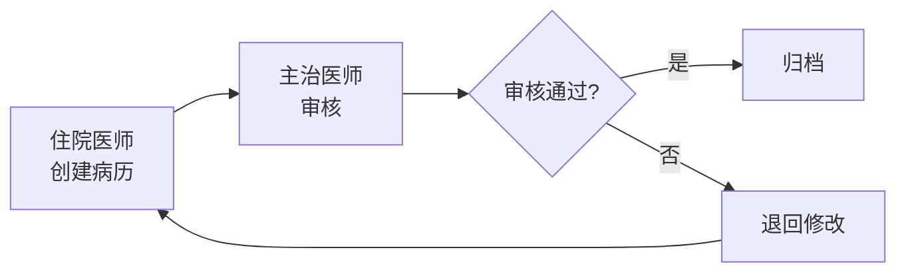

# 精智医疗 —— 电子病历（EMR）使用手册

> 版本：v3.2.0 | 更新日期：2026-04-20

---

## 1. 产品概述

精智医疗电子病历系统（Electronic Medical Record，EMR）是 HIS 核心组成部分，实现病历的数字化录入、存储、查询和归档管理。系统提供结构化模板、智能辅助录入、全流程质控等功能，帮助医护人员高效、规范地完成病历书写。

---

## 2. 登录与界面布局

### 2.1 登录系统

1. 打开浏览器，访问机构内 HIS 系统地址。
2. 输入个人账号和密码（初始密码为身份证号后 6 位，首次登录需修改）。
3. 支持短信验证码登录和指纹登录（需硬件支持）。
4. 登录成功后进入工作台首页。

### 2.2 工作台界面布局

```
┌─────────────────────────────────────────────┐
│  顶部导航栏：系统名称 / 当前院区 / 用户信息    │
├──────────┬──────────────────────────────────┤
│          │  患者信息概览                      │
│  左侧栏  │  ────────────────────────────────  │
│  (患者    │  病历文书列表                      │
│   列表)   │  ────────────────────────────────  │
│          │  病历编辑区                        │
│          │                                  │
├──────────┴──────────────────────────────────┤
│  底部状态栏：连接状态 / 未完成记录数 / 提示     │
└─────────────────────────────────────────────┘
```

### 2.3 主要功能区域

| 区域 | 功能说明 |
|------|----------|
| 左侧患者列表 | 当前科室/医生待接诊和已接诊的患者列表 |
| 患者信息概览 | 患者基本信息（姓名、性别、年龄、就诊号、诊断） |
| 病历文书列表 | 已创建的病历文书（门诊病历、入院记录、病程记录等） |
| 病历编辑区 | 当前选中文书的编辑界面 |

---

## 3. 病历操作

### 3.1 新建病历

#### 门诊病历

1. 在患者列表中选择已挂号患者，点击"接诊"。
2. 系统自动创建门诊病历草稿。
3. 填写主诉、现病史、既往史、体格检查等信息。
4. 录入诊断结果（ICD-10 编码支持检索）。
5. 开具处方、检查或检验申请。
6. 点击"提交"完成病历，患者进入候诊下一环节。

#### 住院病历

入院后由管床医生创建以下文书：

| 文书名称 | 创建时限 | 说明 |
|----------|----------|------|
| 入院记录 | 入院 24 小时内 | 患者基本情况、主诉、现病史、既往史等 |
| 首次病程记录 | 入院 8 小时内 | 病例特点、拟诊讨论、诊疗计划 |
| 日常病程记录 | 住院期间每日 | 病情变化、查体、医嘱调整等 |
| 出院记录 | 出院 24 小时内 | 入院/出院日期、入院/出院诊断、诊疗经过 |

### 3.2 模板使用

#### 模板分类

| 模板类型 | 创建者 | 使用范围 |
|----------|--------|----------|
| 系统模板 | 系统管理员 | 全院通用 |
| 科室模板 | 科室主任 | 本科室 |
| 个人模板 | 医生本人 | 个人 |

#### 使用流程

1. 在病历编辑区点击"模板"按钮。
2. 按分类或搜索找到所需模板。
3. 双击模板名称，内容自动填充到编辑区。
4. 根据实际情况修改和补充内容。
5. 支持部分填充（仅填充选中字段）。

#### 自定义模板

1. 在病历编辑区完成文书内容编写。
2. 点击"存为模板"，填写模板名称和分类。
3. 可选设为个人模板或提交科室主任审批后设为科室模板。
4. 模板变量支持占位符（如 `<患者姓名>` 自动替换）。

### 3.3 病历审核与归档

#### 审核流程



#### 归档规则

- **运行病历**：患者在院期间，病历处于编辑状态。
- **归档病历**：患者出院后，病历自动归档或手动归档。
- **归档锁定**：归档后病历自动锁定，不可编辑。
- **归档解锁**：特殊情况需解锁归档病历的，需提交申请，经科室主任和医务部审批。

---

## 4. 病历查询

### 4.1 快速查询

1. 在顶部搜索框中输入患者姓名、就诊号、身份证号或手机号。
2. 系统实时匹配并显示结果列表。
3. 支持模糊查询（如输入"张"可检索所有姓张的患者）。

### 4.2 高级查询

支持组合条件过滤：

| 查询条件 | 输入类型 | 示例 |
|----------|----------|------|
| 就诊时间段 | 日期范围 | 2026-03-01 ~ 2026-03-31 |
| 科室 | 下拉选择 | 内科 / 外科 / 儿科 |
| 诊断名称 | 文本输入 | 2 型糖尿病 |
| 医生姓名 | 文本输入 | 王建国 |
| 住院号 | 精确输入 | ZY2026001234 |

### 4.3 全文检索

基于 Elasticsearch 引擎，支持对病历全文的快速检索：

- 支持关键词高亮显示。
- 支持精确匹配和分词检索。
- 支持按文书类型过滤（如仅检索"入院记录"）。
- 支持检索结果的导出（CSV 格式）。

---

## 5. 数据安全

### 5.1 权限控制

| 角色 | 操作权限 | 数据范围 |
|------|----------|----------|
| 住院医师 | 创建、编辑、提交 | 本人经管患者 |
| 主治医师 | 审核、退回 | 本科室患者 |
| 科室主任 | 本科室所有病历查看/管理 | 本科室患者 |
| 医务部 | 全院病历查看/归档管理 | 全院患者 |
| 信息科 | 系统配置、权限管理 | 不涉及病历内容 |

### 5.2 操作日志

- 所有病历操作（创建、编辑、查看、打印、导出）均记录操作日志。
- 日志包含：操作人、操作时间、操作类型、IP 地址。
- 日志保存期限不少于 3 年。
- 支持审计员后台查询操作日志。

### 5.3 数据加密

- 病历正文在数据库中以加密形式存储（AES-256）。
- 患者身份敏感信息（姓名、证件号、联系方式）单独加密存储。
- 传输过程使用 HTTPS + TLS 1.3 加密。
- 打印的病历包含水印（打印时间、打印人、机构名称）。

---

## 6. 故障处理

### 6.1 常见问题

| 问题 | 可能原因 | 解决方案 |
|------|----------|----------|
| 无法登录 | 密码错误/账号锁定 | 联系管理员重置密码 |
| 病历无法保存 | 网络中断/会话超时 | 刷新页面重新操作 |
| 模板加载失败 | 缓存异常 | 清除浏览器缓存（Ctrl+F5） |
| 打印排版错乱 | 浏览器兼容性 | 使用 Chrome/Edge 浏览器 |
| 患者信息加载慢 | 网络带宽不足 | 联系信息科检查网络 |

### 6.2 紧急预案

- **系统宕机**：启动手工纸质病历流程，系统恢复后 24 小时内补录。
- **数据丢失**：联系信息科从备份恢复，恢复时间不超过 4 小时。
- **网络中断**：切换至本地网络或 4G/5G 热点应急。

---

## 7. 版本历史

| 版本 | 更新日期 | 主要变更 |
|------|----------|----------|
| v1.0 | 2024-03 | 初始版本，支持门诊病历和基本模板 |
| v2.0 | 2024-09 | 新增住院病历、病程记录、归档管理 |
| v2.5 | 2025-01 | 重构编辑器，支持富文本和结构化录入 |
| v3.0 | 2025-06 | 引入全文检索引擎，新增模板审批流程 |
| v3.2 | 2026-04 | 优化移动端适配，新增病历质控面板 |

---

> **内部支持**：信息科热线 8001（内线）；问题反馈通过内部运维系统提交。
