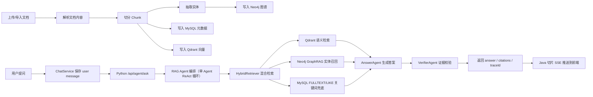
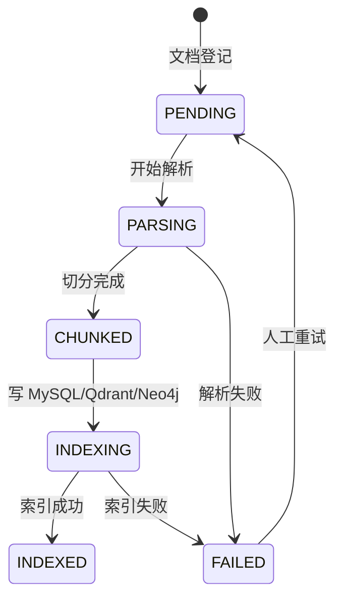

# 业务流程设计

这份文档用于面试讲解和后续开发排期，重点说明项目如何从"数据进入系统"走到"Agent 给出可解释结果"。

## 1. 企业知识库 RAG Agent

### 1.1 业务目标

企业内部文档分散在接口文档、故障说明、运维手册、产品规则中。RAG Agent 的目标是让用户用自然语言提问，并得到带引用、可追踪、可拒答的答案。

### 1.2 参与角色

- 普通用户：提出业务、技术、排障相关问题，查看答案和引用来源。
- 知识库管理员：创建知识库、导入文档、处理索引失败文档。
- 开发者：维护 prompt、检索策略和模型配置。
- 平台管理员：维护客户、用户、权限和基础设施。

### 1.3 主流程



### 1.4 文档状态流转



### 1.5 关键业务规则

- 每条文档必须归属于一个 kb_space，并带有 customer_id。
- 每个 chunk 在 MySQL 中保存正文和元数据，在 Qdrant 中保存向量，在 Neo4j 中挂载实体关系。
- 查询时必须携带 customer_id，从 JWT 解析，不信任前端传入。
- 没有证据时必须拒答，避免大模型编造企业知识。
- agent_trace 记录每个 Agent 节点的输入摘要、输出摘要、耗时和元数据，便于排障和质量评估。

### 1.6 异常分支

- 文档解析失败：文档状态置为 FAILED，记录失败原因，允许管理员重试。
- Qdrant 写入失败：MySQL 元数据仍保留，文档状态置为 FAILED，避免出现"只入库不入向量"的半成品索引。
- Neo4j 写入失败：不阻断基础 RAG，但需要记录告警；GraphRAG 召回会自动降级。
- 大模型调用失败：返回明确错误，并通过 agent_trace 保留失败节点。
- 检索无结果：Verifier 返回拒答文案，引导用户补充文档或换问法。

### 1.7 检索优先级

1. Qdrant：负责语义召回，适合用户说法和文档原文不完全一致的场景。
2. Neo4j：负责 GraphRAG 召回，适合错误码、接口、业务概念之间存在关系的场景。
3. MySQL FULLTEXT/LIKE：负责关键词兜底，适合精确错误码、接口路径、类名查询。
4. NO_EVIDENCE：所有召回源均无证据时拒答，不生成无来源内容。

### 1.8 验收标准

- 用户提问后，接口返回 answer、citations、traceId。
- citations 至少包含 chunk id、文档标题、分数和预览。
- agent_trace 能看到 Router、Rewrite、Retriever、Answer、Verifier 五个节点的摘要。
- 无证据问题不会生成编造答案。
- 同一客户只能检索本客户数据。

### 1.9 后续增强

- 增加 ACL 过滤：按部门、角色、用户过滤文档和 chunk。
- 增加 reranker：使用 bge-reranker 或 LLM 对多路召回结果重排。
- 增加 system prompt 优化流程：基于 Trace 和人工抽样复盘回答情况，形成候选 prompt 后再人工验证发布。

## 2. Java 微服务故障诊断 Agent（规划中）

### 2.1 业务目标

把 Java 后端排障经验产品化：用户输入服务名、traceId、故障现象，Agent 自动检索日志、代码、历史工单，给出根因排序和处理动作。

### 2.2 当前状态

本功能处于**规划设计阶段**，尚未实现。当前实现聚焦于企业知识库 RAG（第 1 节）。以下为后续扩展方向：

- 日志导入脚本（负责写入 obs_log_event）
- 代码索引服务
- 历史工单导入脚本（负责写入 incident_ticket）
- MCP 风格工具协议和对应的诊断 Agent

### 2.3 后续开发顺序

1. 先实现日志/代码/工单的导入脚本和数据表
2. 搭建诊断 Agent 框架，复现 RAG Agent 的 ReAct 编排模式
3. 实现 MCP 工具协议，统一包装日志/代码/工单检索
4. 实现根因打分和修复动作生成

### 2.4 面试讲解重点

- 这个项目不是普通 ChatBot，而是把 Java 微服务排障流程 Agent 化。
- MCP 工具服务把日志、代码、工单包装成统一工具，后续可以替换成 Elasticsearch、GitLab、Jira、Prometheus。
- 第一版使用规则打分保证稳定性，后续可以把历史诊断样本沉淀为训练数据，升级为 LLM verifier 或分类模型。

## 3. 开发闭环

### 3.1 完整服务

```bash
make up
make ingest-a
make smoke
```

### 3.2 单元测试

```bash
make test-python
make test-java
```
