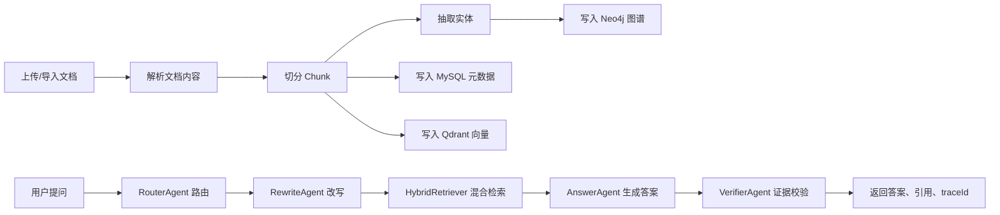
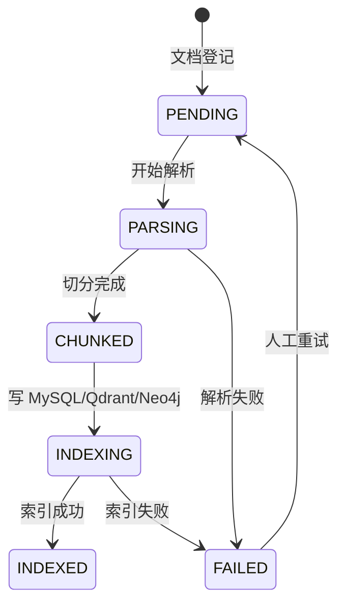
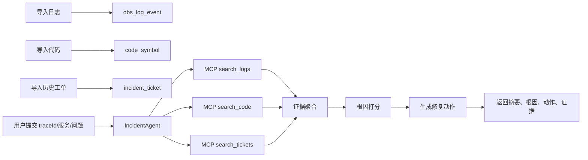
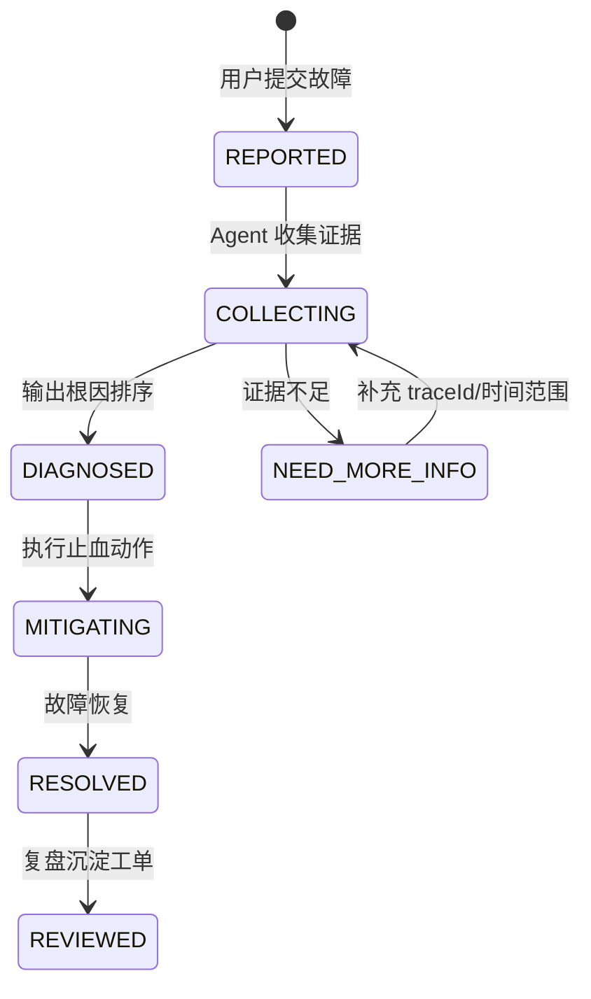

# 业务流程设计

这份文档用于面试讲解和后续开发排期，重点说明两个项目如何从“数据进入系统”走到“Agent 给出可解释结果”。

## 1. 企业知识库 RAG Agent

### 1.1 业务目标

企业内部文档分散在接口文档、故障说明、运维手册、产品规则中。RAG Agent 的目标是让用户用自然语言提问，并得到带引用、可追踪、可拒答的答案。

### 1.2 参与角色

- 普通用户：提出业务、技术、排障相关问题，查看答案和引用来源。
- 知识库管理员：创建知识库、导入文档、处理索引失败文档。
- 算法/Agent 开发者：维护 prompt、检索策略、评测集和模型配置。
- 平台管理员：维护租户、用户、权限和基础设施。

### 1.3 主流程



### 1.4 文档状态流转



落库字段建议：

- `kb_document.status` 保存主状态。
- `kb_document.version` 每次重建索引递增。
- `kb_document.content_hash` 用于跳过重复导入。
- `kb_doc_chunk.metadata` 保存页码、标题层级、实体、ACL 快照。

### 1.5 关键业务规则

- 每条文档必须归属于一个 `kb_space`，并带有 `tenant_id`。
- 每个 chunk 在 MySQL 中保存正文和元数据，在 Qdrant 中保存向量，在 Neo4j 中挂载实体关系。
- 查询时必须携带 `tenant_id`，后续接入登录后应从 JWT 解析，而不是信任前端传入。
- 没有证据时必须拒答，避免大模型编造企业知识。
- `agent_trace` 记录每个 Agent 节点的输入摘要、输出摘要、耗时和元数据，便于面试演示可观测性。

### 1.6 异常分支

- 文档解析失败：文档状态置为 `FAILED`，记录失败原因，允许管理员重试。
- Qdrant 写入失败：MySQL 元数据仍保留，文档状态置为 `FAILED`，避免出现“只入库不入向量”的半成品索引。
- Neo4j 写入失败：不阻断基础 RAG，但需要记录告警；GraphRAG 召回会自动降级。
- 大模型调用失败：返回降级文案，并通过 `agent_trace` 保留失败节点。
- 检索无结果：Verifier 返回拒答文案，引导用户补充文档或换问法。

### 1.7 检索优先级

1. Qdrant：负责语义召回，适合用户说法和文档原文不完全一致的场景。
2. Neo4j：负责 GraphRAG 召回，适合错误码、接口、业务概念之间存在关系的场景。
3. MySQL FULLTEXT/LIKE：负责关键词兜底，适合精确错误码、接口路径、类名查询。
4. Mock：只用于本地演示，不作为生产逻辑。

### 1.8 验收标准

- 用户提问后，接口返回 `answer`、`citations`、`traceId`。
- `citations` 至少包含 chunk id、文档标题、分数和预览。
- `agent_trace` 能看到 Router、Rewrite、Retriever、Answer、Verifier 五个节点。
- 无证据问题不会生成编造答案。
- 同一租户只能检索本租户数据。

### 1.9 后续增强

- 增加 ACL 过滤：按部门、角色、用户过滤文档和 chunk。
- 增加 reranker：使用 bge-reranker 或 LLM 对多路召回结果重排。
- 增加反馈闭环：用户点赞/点踩进入 `eval_case`，作为后续微调和提示词优化数据。

## 2. Java 微服务故障诊断 Agent

### 2.1 业务目标

把 Java 后端排障经验产品化：用户输入服务名、traceId、故障现象，Agent 自动检索日志、代码、历史工单，给出根因排序和处理动作。

### 2.2 参与角色

- 值班研发：提交故障问题，查看根因和处理建议。
- 服务负责人：维护服务信息、代码索引和历史工单。
- SRE/运维：维护日志、指标、告警和发布记录接入。
- Agent 开发者：维护工具协议、根因规则和诊断评测集。

### 2.3 主流程



### 2.4 故障处理状态流转



### 2.5 关键业务规则

- 日志证据优先级最高，因为它直接反映线上异常。
- 代码证据用于确认异常位置、空指针风险、接口契约和边界条件。
- 历史工单用于召回相似案例，提升诊断效率。
- 根因必须带置信度和证据说明，不能只返回一句“可能是某问题”。
- 修复动作必须可执行，例如“增加 null check”“补单测”“临时关闭分支”。

### 2.6 异常分支

- traceId 为空：允许按服务名、时间范围和异常关键词检索，但置信度降低。
- 日志无结果：提示检查时间范围、服务名、环境，并继续使用代码和工单证据。
- 代码索引无结果：返回日志和历史工单分析，同时提示需要重新导入代码索引。
- 工单无结果：不影响诊断，只是少一个历史案例维度。
- MCP 工具不可用：Agent 返回降级结果，提示工具服务异常，避免接口整体失败。

### 2.7 验收标准

- 输入服务名、问题、traceId 后，返回 `summary`、`root_causes`、`actions`、`evidences`。
- `root_causes` 必须按置信度降序排列。
- 每个根因必须有 evidence 说明。
- `actions` 至少包含代码修复、测试补充和临时止血建议。
- 工具服务不可用时接口仍能返回可解释的降级响应。

### 2.8 面试讲解重点

- 这个项目不是普通 ChatBot，而是把 Java 微服务排障流程 Agent 化。
- MCP 工具服务把日志、代码、工单包装成统一工具，后续可以替换成 Elasticsearch、GitLab、Jira、Prometheus。
- 第一版使用规则打分保证稳定性，后续可以把历史诊断样本沉淀为训练数据，升级为 LLM verifier 或分类模型。

## 3. 开发闭环

### 3.1 本地演示

```bash
python3 scripts/local_demo.py
```

### 3.2 完整服务

```bash
make up
make ingest-a
make ingest-b
make smoke
```

### 3.3 单元测试

```bash
make test-python
make test-java
```

### 3.4 评测

```bash
make eval
```

评测结果后续可以写入 `eval_result`，用于对比不同 embedding、reranker、prompt 和模型版本。
