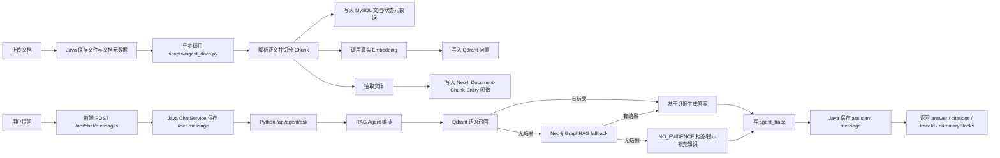
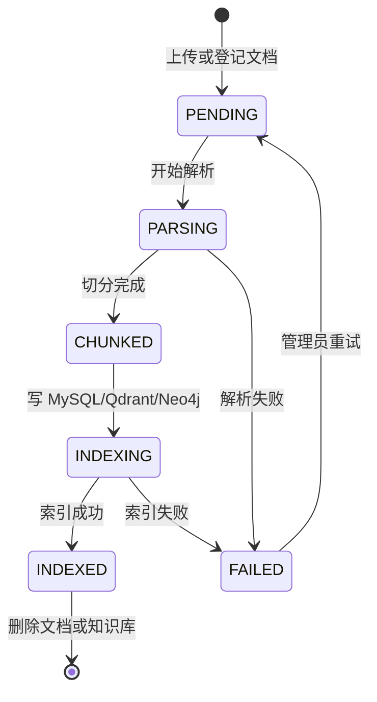
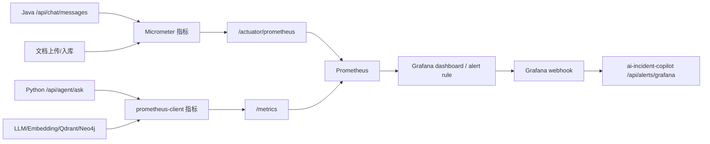

# 业务流程设计

本文档用于说明当前项目从“文档进入系统”到“Agent 给出可解释答案”，再到“业务指标触发告警”的主链路。故障事件诊断本身由相邻项目 `ai-incident-copilot` 承接，本仓库负责提供 RAG 能力、业务指标和 Grafana webhook 集成。

## 1. 企业知识库 RAG Agent

### 1.1 业务目标

企业内部文档分散在接口文档、故障说明、运维手册和产品规则中。RAG Agent 的目标是让用户用自然语言提问，并得到带引用、可追溯、可拒答的答案。当前实现强调真实模型调用和真实检索链路，不使用静默 mock 结果。

### 1.2 参与角色

| 角色 | 职责 |
| --- | --- |
| 普通用户 | 提出业务、技术、排障相关问题，查看答案、引用和 Trace。 |
| 知识库管理员 | 创建知识库、上传文档、查看入库状态、处理失败文档并重试。 |
| 开发者 | 维护 prompt、检索策略、模型配置、Trace 和指标。 |
| 平台管理员 | 维护客户、用户、角色权限和基础设施。 |

### 1.3 主流程



### 1.4 文档状态流转



### 1.5 关键业务规则

- 每条文档必须归属于一个 `kb_space`，并带有 `customer_id`。
- 每个 chunk 在 MySQL 中保留正文和元数据，在 Qdrant 中保存向量，在 Neo4j 中挂载实体关系。
- 查询时客户上下文来自 JWT，不信任前端直接传入的客户 ID。
- 没有证据时必须拒答或提示补充知识，避免大模型编造企业知识。
- `agent_trace` 记录 Agent 节点输入摘要、输出摘要、耗时和元数据，便于排障和质量评估。
- 缺失模型凭证、embedding 失败、向量写入失败等关键路径必须明确失败；只有显式 dry-run/test 路径可以跳过外部写入。

### 1.6 当前检索优先级

1. Qdrant：负责语义召回，适合用户说法和文档原文不完全一致的场景。
2. Neo4j：当 Qdrant 无结果时，基于错误码、API、系统、模块、业务术语等实体做 GraphRAG fallback。
3. NO_EVIDENCE：Qdrant 和 Neo4j 均无证据时，返回空证据并拒答或提示补充知识。

MySQL 当前不参与在线检索兜底，只承担知识库元数据、文档状态、会话消息、Trace 和管理查询。

### 1.7 验收标准

- `POST /api/chat/messages` 返回 `answer`、`citations`、`traceId` 和摘要信息。
- citations 至少包含 chunk id、文档标题、分数和预览。
- `agent_trace` 能看到准备上下文、检索、回答生成、拒答等关键节点。
- 无证据问题不会生成无来源答案。
- 同一客户只能访问本客户数据。

### 1.8 后续增强

- 增加 ACL 过滤：按部门、角色、用户过滤文档和 chunk。
- 增加 reranker：使用 bge-reranker 或 LLM 对多路召回结果重排。
- 增加 system prompt 优化闭环：基于 Trace 和人工抽样复盘回答情况，形成候选 prompt 后再人工验证发布。

## 2. 可观测性与 Incident Copilot 集成

### 2.1 业务目标

把 RAG 问答、文档入库、模型调用、embedding、Qdrant、Neo4j、Redis 和 MySQL 等真实业务指标暴露给 Prometheus/Grafana。当 Grafana 规则触发时，通过 webhook 推送到相邻项目 `ai-incident-copilot`，由对方创建或关联事件、匹配 runbook、生成诊断建议。

### 2.2 当前链路



### 2.3 边界说明

- 本仓库提供 metrics、dashboard、alert rule 和 webhook 字段映射。
- 本仓库不实现独立 MCP 诊断 Agent，不保存 Incident Copilot 的事件模型。
- `make smoke-alert` 只验证 Grafana webhook payload 到 Incident Copilot 的入站契约，不替代真实 Prometheus/Grafana 采集。

### 2.4 验收标准

- `GET /actuator/prometheus` 能看到 Java 业务指标。
- `GET /metrics` 能看到 Python AI Service 指标。
- Grafana 能展示 Chat/RAG、Dependencies、Knowledge Ingestion 等看板。
- 触发超时、空召回、Qdrant/Neo4j 异常或入库失败后，Incident Copilot 入站状态为 `INCIDENT_CREATED` 或 `CORRELATED`。

## 3. 开发闭环

```bash
make up
make smoke
make smoke-alert
```

单独验证：

```bash
make test-python
make test-java
```
