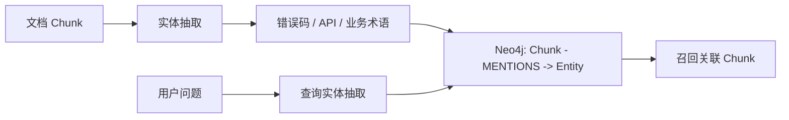

# RAG 实体抽取学习版设计

本文只讨论当前项目里最适合学习和演示的实体抽取方式。重点不是把所有可能的实体都抽出来，
而是理解实体抽取在 RAG/GraphRAG 中到底解决什么问题。

## 1. 实体抽取在 RAG 里的作用

普通向量检索擅长语义相似，但对精确符号不稳定，例如错误码、接口路径、业务术语。
实体抽取的作用是把这些“可精确匹配的锚点”抽出来，写入图谱：



所以当前阶段的目标很简单：

- 文档入库时，知道每个 chunk 提到了哪些关键实体。
- 用户查询时，抽出同类实体。
- 当向量检索没命中时，用实体在图谱里找回相关 chunk。

## 2. 当前只保留三类实体

学习版只保留最常见、最容易讲清楚的实体类型：

| 类型 | 来源 | 示例 | 用途 |
| --- | --- | --- | --- |
| `ERROR_CODE` | 正则规则 | `PAY_5001` | 错误码精确召回 |
| `API_ENDPOINT` | 正则规则 | `/api/pay/callback` | 接口文档精确召回 |
| `BUSINESS_TERM` / `SYSTEM` | 领域词典 | `支付回调`, `支付系统` | 业务概念和系统名召回 |

这里不再抽配置项、代码类名、数据表、技术组件等实体。它们不是不能抽，而是对当前学习主线干扰太大。
等这个闭环跑清楚后，再扩展实体类型会更自然。

## 3. 主流实现方式

当前实现采用主流项目里的基础模式：

1. 规则抽取：用正则抽格式稳定的实体，例如错误码和 API。
2. 领域词典：业务词由知识库或业务配置提供，例如 `{"支付回调": "BUSINESS_TERM"}`。
3. 规范化：错误码统一大写，API 去掉末尾 `/`。
4. 去重合并：同一个实体多次出现，只保留一个实体节点，但记录多次 mention。

输出结构保持简单：

```json
{
  "name": "PAY_5001",
  "type": "ERROR_CODE",
  "source": "rule",
  "confidence": 0.96,
  "mentions": [{"text": "PAY_5001", "start": 0, "end": 8}],
  "occurrence_count": 1
}
```

这个结构已经足够支持 GraphRAG 的最小闭环，也足够后续替换成 NER 或 LLM 抽取。

## 4. 为什么不做复杂设计

实体抽取学习阶段最容易偏移到“实体治理平台”：别名库、置信度融合、多类型识别、复杂过滤、
多跳关系抽取。这些都是真实系统可能会做的事，但不是第一阶段重点。

当前项目的实体抽取应该先讲清楚：

- 哪些实体适合规则抽取。
- 哪些实体应该来自业务词典。
- 为什么要记录 mention 位置。
- 为什么实体能补足向量检索对精确符号的短板。

后续增强顺序建议：

1. 给每个知识库配置独立领域词典。
2. 引入 LLM/NER 作为候选实体补充。
3. 在图谱里增加实体之间的关系抽取。
4. 用实体覆盖率和 occurrence_count 做图谱召回排序。
