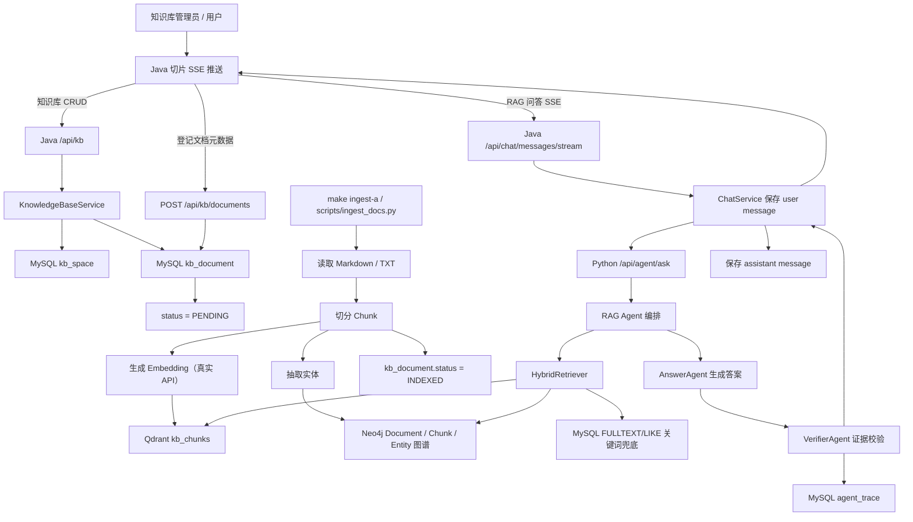
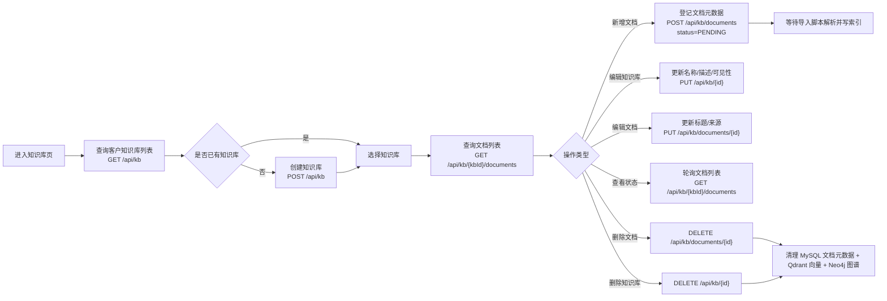
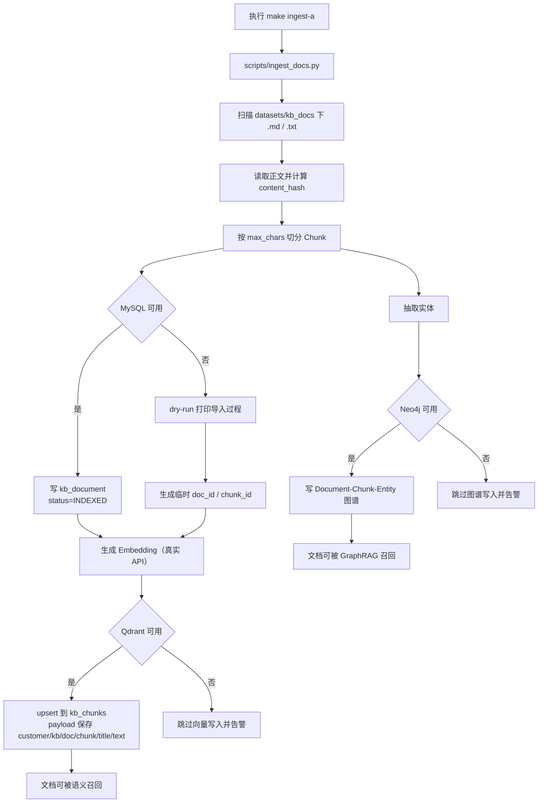
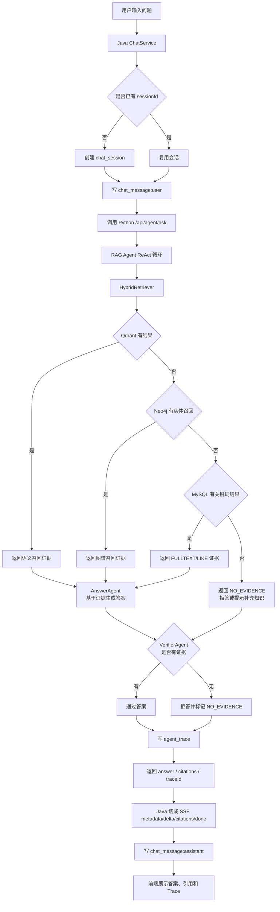
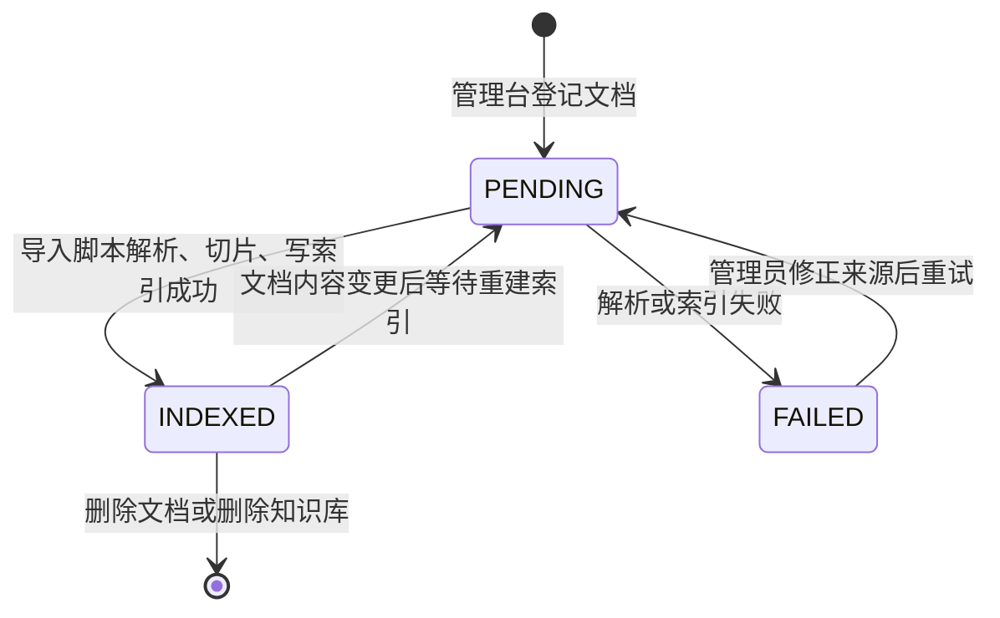
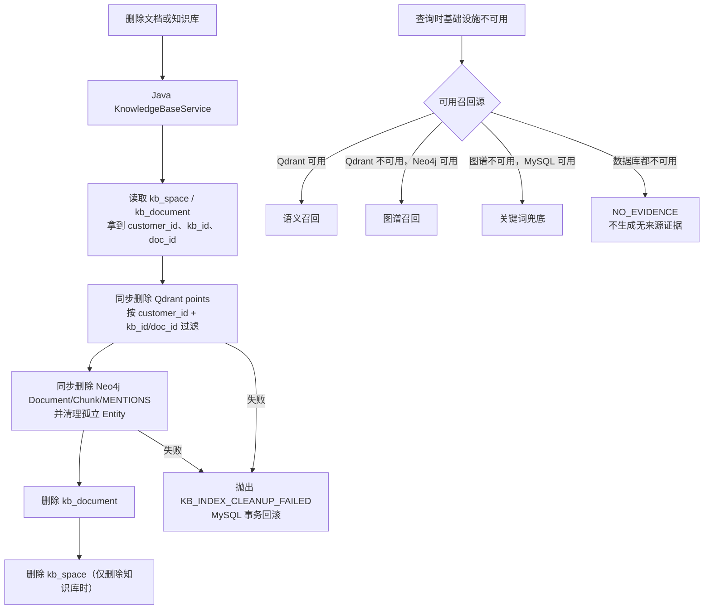

# 知识库相关操作流程图

本文档聚焦知识库从管理台维护、文档导入索引，到 RAG 问答和删除清理的完整操作链路。

## 1. 总体链路

## 2. 管理台操作流

## 3. 文档导入与索引流

## 4. RAG 问答流

## 5. 文档状态流转

## 6. 删除与降级边界

## 7. 操作和存储映射

| 操作 | 前端入口 | Java 接口 | 主要存储 | 说明 |
| --- | --- | --- | --- | --- |
| 创建知识库 | 知识库空间表单 | `POST /api/kb` | `kb_space` | 创建客户级知识库入口 |
| 查询知识库 | 当前知识库下拉框 | `GET /api/kb` | `kb_space` | 按客户隔离 |
| 更新知识库 | 编辑空间信息 | `PUT /api/kb/{id}` | `kb_space` | 不触发索引重建 |
| 删除知识库 | 删除按钮 | `DELETE /api/kb/{id}` | MySQL、Qdrant、Neo4j | 同步清理外部索引；失败则 MySQL 删除回滚 |
| 登记文档 | 文档表单 | `POST /api/kb/documents` | `kb_document` | 默认 PENDING |
| 导入文档 | `make ingest-a` | `scripts/ingest_docs.py` | MySQL、Qdrant、Neo4j | 解析、切片、向量、图谱 |
| 删除文档 | 删除按钮 | `DELETE /api/kb/documents/{id}` | MySQL、Qdrant、Neo4j | 同步清理外部索引；失败则 MySQL 删除回滚 |
| RAG 问答 | RAG 调试台 | `/api/chat/messages/stream` -> `/api/agent/ask` | `chat_message`、`agent_trace` | 返回答案、引用、traceId |

## 8. 一致性说明

MySQL、Qdrant 和 Neo4j 不是同一个事务资源，当前项目也没有 XA/2PC 协议支持，所以不能把三者变成真正的单一 ACID 事务。删除链路采用同步强校验方案：外部索引先按幂等条件删除，任何一个外部存储失败都会抛出业务异常，Spring 事务回滚 MySQL 元数据删除。这样可以避免最常见、最危险的状态：管理台已经看不到文档，但 RAG 仍能从向量库或图谱召回旧内容。

生产级进一步增强建议是增加 outbox/tombstone 表：先在 MySQL 事务内把知识库或文档标记为 DELETING 并写清理任务，读路径过滤 DELETING；后台 worker 幂等清理 Qdrant/Neo4j，成功后再物理删除 MySQL 元数据。这样即使服务在外部删除成功、MySQL 提交前崩溃，也能通过任务表和对账任务收敛到一致状态。
